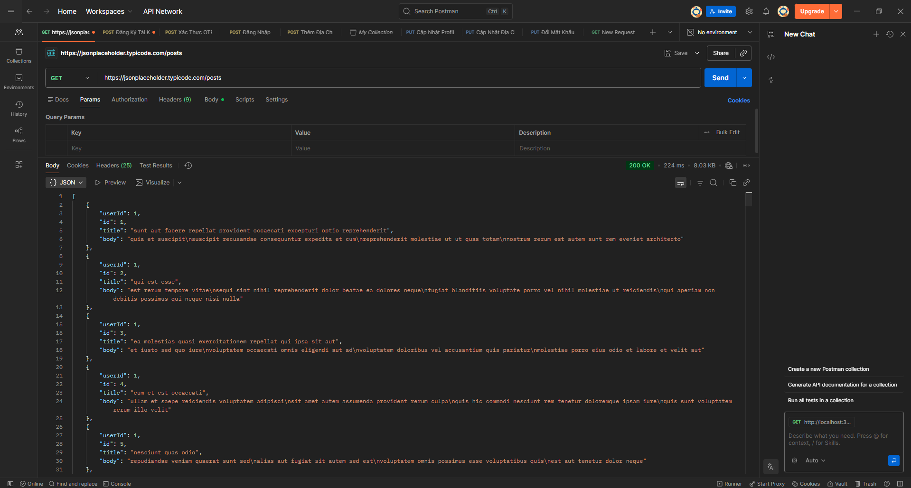
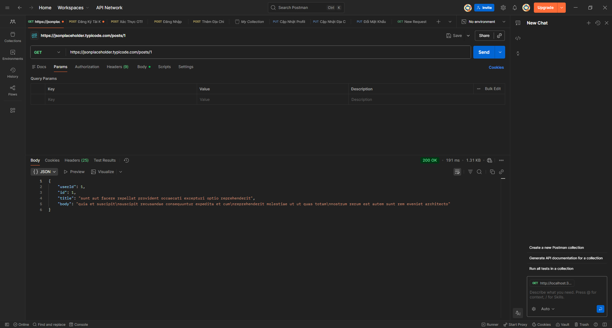
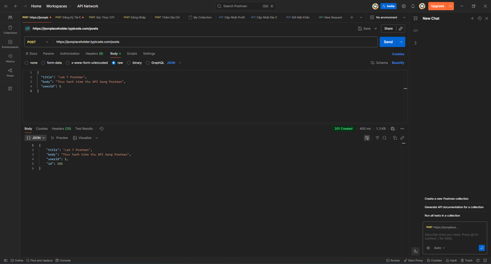
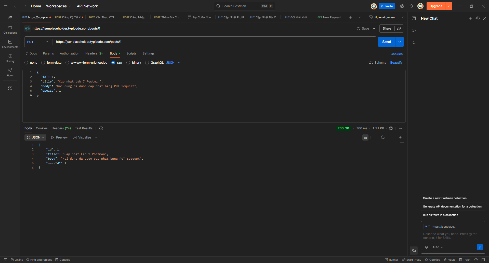
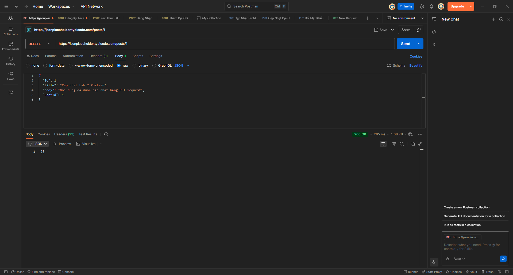

# Báo cáo Lab 7 — Kiểm thử API bằng Postman

## Thông tin chung

| Mục | Nội dung |
| --- | --- |
| **Bài lab** | Lab 7 — Postman |
| **Chủ đề** | Sử dụng Postman để kiểm thử API |
| **Công cụ** | Postman, GitHub |
| **API thực hành** | [JSONPlaceholder](https://jsonplaceholder.typicode.com) |
| **Repository** | https://github.com/ndviet0303/postman-assignment |

---

## 1. Giới thiệu

**Postman** là công cụ hỗ trợ kiểm thử API, cho phép gửi các HTTP request (`GET`, `POST`, `PUT`, `DELETE`) tới server và quan sát dữ liệu phản hồi.

Trong bài lab này, em sử dụng Postman để kiểm thử API **JSONPlaceholder** — dịch vụ API mẫu phổ biến khi học và thử nghiệm REST API.

---

## 2. Mục tiêu bài lab

- Tìm hiểu cách sử dụng Postman
- Gửi request API với nhiều phương thức HTTP
- Thực hành `GET`, `POST`, `PUT`, `DELETE`
- Kiểm tra status code và response body
- Ghi lại kết quả bằng hình ảnh minh họa
- Viết báo cáo trong file `README.md` trên GitHub

---

## 3. Môi trường kiểm thử

| Thành phần | Nội dung |
| --- | --- |
| Công cụ kiểm thử | Postman |
| Quản lý mã nguồn | GitHub |
| API | JSONPlaceholder |
| Base URL | `https://jsonplaceholder.typicode.com` |
| Định dạng dữ liệu | JSON |

---

## 4. Phương pháp thực hiện

Kiểm thử thủ công bằng Postman. Với mỗi request:

1. Chọn phương thức HTTP
2. Nhập URL API
3. Nhập JSON trong **Body** (nếu cần)
4. Nhấn **Send**
5. Quan sát status code và response body
6. Chụp ảnh màn hình
7. Tổng hợp vào báo cáo

---

## 5. Các kịch bản kiểm thử

### 5.1. Lấy danh sách bài viết

| | |
| --- | --- |
| **Phương thức** | `GET` |
| **URL** | `https://jsonplaceholder.typicode.com/posts` |
| **Mục đích** | Kiểm tra API trả về danh sách bài viết |
| **Kết quả mong đợi** | Status `200 OK`, JSON gồm `userId`, `id`, `title`, `body` |
| **Kết quả thực tế** | Trả về danh sách bài viết thành công |
| **Trạng thái** | Thành công |



---

### 5.2. Lấy chi tiết bài viết theo ID

| | |
| --- | --- |
| **Phương thức** | `GET` |
| **URL** | `https://jsonplaceholder.typicode.com/posts/1` |
| **Mục đích** | Lấy đúng bài viết có `id = 1` |
| **Kết quả mong đợi** | Status `200 OK`, response có `id = 1` |
| **Kết quả thực tế** | Trả về đúng bài viết ID 1 |
| **Trạng thái** | Thành công |



---

### 5.3. Tạo mới bài viết

| | |
| --- | --- |
| **Phương thức** | `POST` |
| **URL** | `https://jsonplaceholder.typicode.com/posts` |
| **Header** | `Content-Type: application/json` |
| **Mục đích** | Gửi JSON và nhận bài viết mới |
| **Kết quả mong đợi** | Status `201 Created`, response có thêm `id` |
| **Kết quả thực tế** | Tạo bài viết thành công |
| **Trạng thái** | Thành công |

**Body (JSON):**

```json
{
  "title": "Lab 7 Postman",
  "body": "Thuc hanh kiem thu API bang Postman",
  "userId": 1
}
```



---

### 5.4. Cập nhật bài viết

| | |
| --- | --- |
| **Phương thức** | `PUT` |
| **URL** | `https://jsonplaceholder.typicode.com/posts/1` |
| **Header** | `Content-Type: application/json` |
| **Mục đích** | Cập nhật nội dung bài viết |
| **Kết quả mong đợi** | Status `200 OK`, `title` và `body` đã đổi |
| **Kết quả thực tế** | Trả về dữ liệu sau cập nhật |
| **Trạng thái** | Thành công |

**Body (JSON):**

```json
{
  "id": 1,
  "title": "Cap nhat Lab 7 Postman",
  "body": "Noi dung da duoc cap nhat bang PUT request",
  "userId": 1
}
```



---

### 5.5. Xóa bài viết

| | |
| --- | --- |
| **Phương thức** | `DELETE` |
| **URL** | `https://jsonplaceholder.typicode.com/posts/1` |
| **Mục đích** | Kiểm tra xử lý request xóa |
| **Kết quả mong đợi** | Status `200 OK`, response rỗng hoặc thành công |
| **Kết quả thực tế** | Xóa thành công |
| **Trạng thái** | Thành công |



---

## 6. Bảng tổng hợp kết quả

| STT | Kịch bản | Method | Endpoint | Kết quả mong đợi | Kết quả thực tế | Trạng thái |
| --- | --- | --- | --- | --- | --- | --- |
| 1 | Lấy danh sách bài viết | `GET` | `/posts` | `200 OK`, danh sách JSON | Đúng mong đợi | Thành công |
| 2 | Lấy chi tiết bài viết | `GET` | `/posts/1` | `200 OK`, bài viết `id = 1` | Đúng mong đợi | Thành công |
| 3 | Tạo mới bài viết | `POST` | `/posts` | `201 Created`, có `id` mới | Đúng mong đợi | Thành công |
| 4 | Cập nhật bài viết | `PUT` | `/posts/1` | `200 OK`, dữ liệu đã cập nhật | Đúng mong đợi | Thành công |
| 5 | Xóa bài viết | `DELETE` | `/posts/1` | `200 OK`, xóa thành công | Đúng mong đợi | Thành công |

---

## 7. Nhận xét

Postman trực quan và dễ dùng khi kiểm thử API: chọn method, nhập URL, gửi JSON và xem phản hồi ngay trên giao diện.

Các request trong lab đều trả về đúng mong đợi; JSONPlaceholder phù hợp để thực hành kiểm thử API cơ bản.

---

## 8. Kết luận

Sau bài lab, em đã nắm cách dùng Postman để gửi `GET`, `POST`, `PUT`, `DELETE`, kiểm tra status code, đọc response JSON và ghi lại kết quả bằng ảnh chụp màn hình.

Bài lab giúp hiểu quy trình kiểm thử API cơ bản và vai trò của Postman trong phát triển phần mềm.
